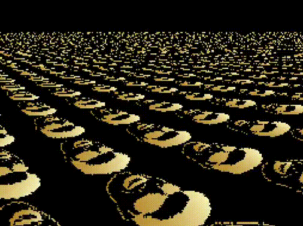

# MODE 7 Engine

My implementation of a MODE 7 engine written in C using SDL2 library. This was done solely for educational purposes and has many flaws: Inefficient algorithm, fisheye effect, no 'roll' movement and poor 'yaw'. Reads raw data from uncompressed BMPs as textures.


## Screenshots




## Requirements

- sdl2
- sdl2_image


## Building
Clone the project
```bash
  git clone https://github.com/blr-ophon/simpleM7
```
Compile using:

```bash
  cd simpleM7
  make
```
## Running

Run the executable directly or use make:

```bash
  make run
```


## Usage

Use WASD to move

Use L-shift and space to ascend and descend

Use J and K to turn camera plane up or down

Use `esc` to quit 

